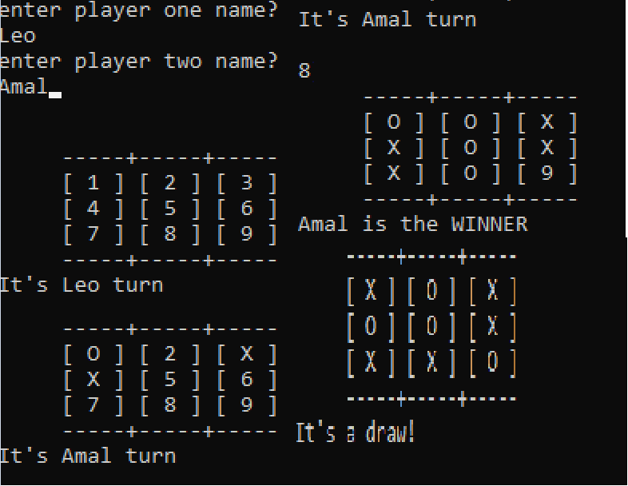

# Tic Tac Toe

  On this project we created a copy of the tic tac toe game, to be player by 2 players using Ruby, the game follows the standard rules of tic tac toe which are explained in the rules section.
  

## Built With

- Ruby

## Setup

- Install git
- Open your local terminal for your specific OS.
- Change the directory using the cd terminal command to a folder.
- Run git clone (link of this repository).
- Install Ruby, google is going to have information about how to install it on your OS.
- Run ruby bin/main.rb to start the game.

## Tic Tac Toe's rules

- The game start with both player choosing their names.
- Player 1 is playing as 'X', while player 2 plays as 'O'
- The game starts with player 1 choosing an available cell in the board and then player 2 choosing an available cell in the board
- A player wins by getting 3 cells marked with their letter, either horizontally, vertically or diagonally
- If none of the players is able to win before the board runs out of available squares it's declared a draw.
- Enjoy

## Authors

👤 **Amal Hersi**

- GitHub: [@Amalcxc](https://github.com/Amalcxc)
- Twitter: [@Amalcx4](https://twitter.com/Amalcx4)
- LinkedIn: [Amal Hersi](https://www.linkedin.com/in/amal-hersi-a29583205/)

👤 **Leonardo L. da Paz**

- GitHub: [@leolpaz](https://github.com/leolpaz)
- Twitter: [@leonardolpaz95](https://twitter.com/leonardolpaz95)
- LinkedIn: [Leonardo Paz](https://www.linkedin.com/in/leonardo-paz-a925611b5/)

## Acknowledgments

- [Microverse](https://www.microverse.org)
- Our standup team

## License
  
This project is <a href="LICENSE">MIT</a> licensed.

